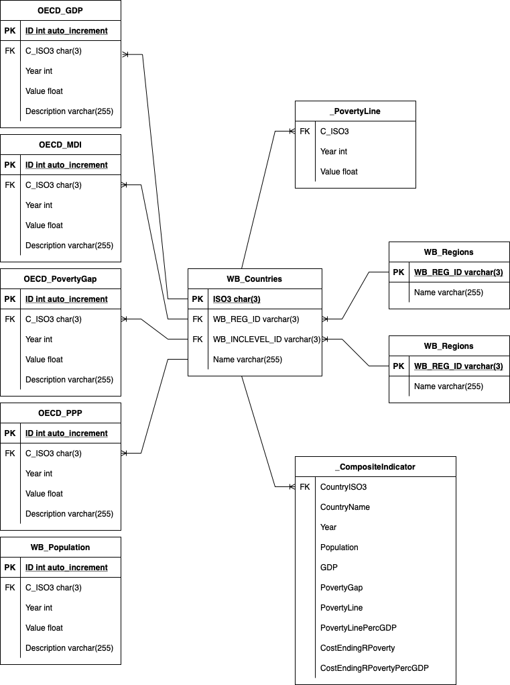

# Poverty Composite Indicator
*Eric Martinet & Shirin Abousalih*

**Data Analytics bootcamp @IronHack Paris, Feb-Apr 22**

## Content
- [Project Description](#project-description)
- [Project Planning](#project-planning)
- [Composite Indicator Methodology](#composite-indicator-methodology)
- [ER Model](#er-model)
- [Datasources](#datasources)
- [Repo structure](#repo-structure)
- [Links](#links)

## Project Description
The goals of this project were:

1. To create a database to store relevant information points about **poverty**,
2. To develop a composite indicator that allows to compare countries and regions,
3. To implement queries that return useful insights about the data.

## Project Organisation
We completed this project over a week-end, using Jira for planning and Slack for communication.

## Composite Indicator Methodology
We have developped the "Cost of Closing Relative Poverty as % of GDP" indicator. It expresses (as % of GDP) the amount of money to be transferred to the poor to take them out of relative poverty (i.e. compared to the rest of the population), assuming perfect transfer targeting and efficiency.

While the Poverty Line helps us measure the *incidence* of poverty, this indicator tries to help us measure its *intensity*.

It is computed as follows:

where:

- *Poverty Gap* is the ratio by which the mean income of the poor falls below the *Poverty Line* (unit: none)
- *Poverty Line* is usually defined as a ratio of the median household income of the total population (unit: currency/period/capita, e.g. $PPP/year/capita)
- *Population* is the total population (unit: capita)
- *GDP* is the Gross Domestic Product (unit: currency/period, e.g. $PPP/year)

> Using GDP as the denominator allows to perform comparisons between economies.

> :warning: Be careful about the consistency of the units!

## ER Model
Our MySQL database is built as follows:

The country ISO3 codes enables to make joins between all tables.

The tables \_PovertyLine and \_CompositeIndicator result from a SELECT query.

## Datasources

We used two sources of data to feed our database.

1. OECD Data: extensive datasets on economy, development, education, health, etc. for OECD countries.
	- GDP: from the Quarterly National Accounts database (code QNA), we fetched the Gross domestic product (expenditure approach) (code B1_GE), expressed in US dollars, current prices, current PPPs, annual levels, seasonally adjusted (code CPCARSA with frequency code A), for all countries and all years between 2000 and 2020
	- Poverty Gap: from the Income database (code IDD), we fetched the Mean Poverty gap after taxes and transfers, Poverty line 50% (code PMEAN5A), based on the most recent 2012 method (code METH2012), for all countries and all years between 2000 and 2020
	- Poverty Line: equals to 50% of MDI expressed in PPP
		- Median Disposable Income (MDI): from the Income database (code IDD), we fetched the Median disposable income (current prices) (code MEDIANC), based on the most recent 2012 method (code METH2012), for all countries and all years between 2000 and 2020
		- Purchasing Power Parities (PPP): from Income database (code IDD), fetching the Purchasing Power Parities for private consumption (code PPPPRC), based on the most recent 2012 method (code METH2012), for all countries and all years between 2000 and 2020

2. World Bank's DataBank: extensive datasets on economy, development, education, health, etc. for all countries in the world.
	- Population: we fetched the Total population (SP.POP.TOTL) for for all countries and all years between 2000 and 2020

## Repo structure

Our repo is organised as follows:

- [Data](./Data): CSV files from data scrapping
- [ERD](./ERD): Entity Relationship Diagram in drawio and PNG formats
- [Python](./Python): Python code for data scrapping (in Jupyter notebook format)
- [SQL](./SQL): SQL code to create, feed and perform analyses on the database (in MySQL Workbench 8.0 format)

## Links
[This repository](https://github.com/eric-martinet/Poverty_composite_indicator/)

Datasources:

- [OECD Data](https://data.oecd.org)
- [World Bank's DataBank](https://databank.worldbank.org)

To explore the topic in a deeper way:

- [Measuring poverty (Wikipedia)](https://en.wikipedia.org/wiki/Measuring_poverty)
- [The size of the poverty gap: some hints regarding the cost of ending extreme poverty](https://ourworldindata.org/size-poverty-gap)